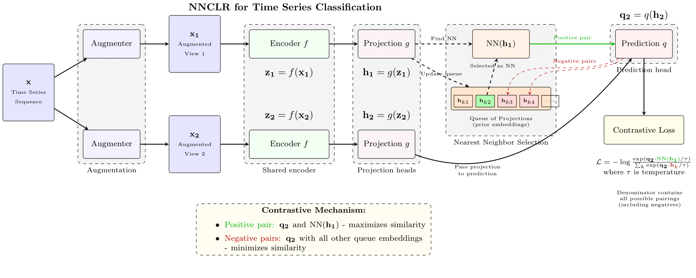

# t-NNCLR: Time Series Nearest-Neighbor Contrastive Learning of Representations

This repository implements t-NNCLR, a self-supervised learning method for time series data classification. t-NNCLR is an adaptation of NNCLR (Nearest-Neighbor Contrastive Learning of Representations) specifically designed for time series data.

## Overview

t-NNCLR leverages contrastive learning and nearest-neighbor selection to learn meaningful representations from unlabeled time series data. The approach consists of two main phases:

1. **Self-supervised Pretraining**: The model learns to distinguish between similar and dissimilar time series segments without using labels.
2. **Supervised Fine-tuning**: The pretrained model is fine-tuned on labeled data for downstream classification tasks.


## Architecture

The t-NNCLR architecture consists of the following components:

1. **Time Series Input**: Time series data from sensors or other sources
2. **Augmentation**: Temporal transformations (jittering, scaling, time warping, permutation) to create different views of the same sequence
3. **Encoder**: Neural network (CNN or Transformer-based) that extracts features from the time series data
4. **Projection Head**: A non-linear transformation that maps encoder features to a space where contrastive learning is performed
5. **Feature Queue**: A queue that stores projected representations from previous batches
6. **Nearest Neighbor Selection**: For each projection, its nearest neighbor is found in the feature queue
7. **Prediction Head**: A non-linear transformation applied to the projection before computing the loss
8. **Contrastive Loss**: Computed between the prediction of one view and the nearest neighbor of another view





## Dataset
The repository includes code to download and process Human Activity Recognition (HAR) data. The dataset contains sensor readings from wearable devices and corresponding activity labels.


## Results

Our experiments show that t-NNCLR can effectively learn from unlabeled time series data and transfer knowledge to supervised tasks. The method achieves competitive classification accuracy on HAR tasks while requiring fewer labeled examples. 
For detailed experimental results, including visualizations of training curves, accuracy across folds, and confusion matrices, please refer to the [t-nnclr.ipynb](./t-nnclr.ipynb) notebook.


## Repository Structure

- `/data`: Scripts for downloading and processing datasets
- `/models`: Neural network architectures for time series processing
- `/utils`: Utility functions for data augmentation and evaluation
- `/notebooks`: Jupyter notebooks for experiments
- `pretrain.py`: Implementation of the self-supervised pretraining phase
- `finetune.py`: Implementation of the supervised fine-tuning phase
- `main.py`: Script to run the full experiment pipeline


## Dependencies
- Python 3.8
- PyTorch 2.4.1+cu121
- NumPy
- Scikit-learn
- matplotlib
- seaborn
- gdown (for data download) 


## Clone and Installation

```bash
# Clone the repository:
git clone https://github.com/imics-lab/t-nnclr.git
cd t-nnclr

# Install dependencies:
pip install -r requirements.txt

# Download the dataset:
python data/download_data.py
```

## Running Experiments
```bash
# You can run experiments using either the main script or the Jupyter notebook:
python main.py

# Or open and run the notebook:
jupyter notebook t-nnclr_example_run.ipynb
```


## Contributing
Pull requests are welcome. For major changes, please open an issue first to discuss what you would like to change.

Please make sure to update tests as appropriate.

